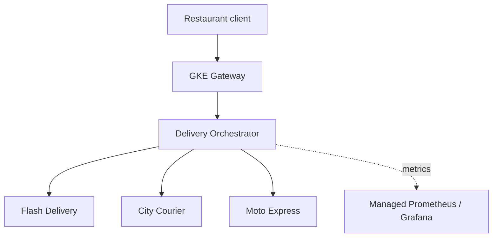

# LeSmartDelivery

> A resilient delivery-option platform for restaurants, built with Java, Spring Boot, Resilience4j, and Google Kubernetes Engine (GKE).

## Project idea

Restaurants often depend on multiple delivery partners. A provider may be slow, temporarily unavailable, return no drivers, or fail after accepting a delivery request. The restaurant should still be able to offer delivery when one partner has a problem.

LeSmartDelivery requests quotes from several delivery providers, compares their price, ETA, and reliability, and recommends the best currently available option. Provider failures are isolated so that one unhealthy dependency does not make the whole platform unavailable.

The project is designed to demonstrate a practical relationship between:

```text
Timeout -> Retry -> Circuit Breaker -> Fallback
```

- **Timeout** limits how long the system waits for one provider attempt.
- **Retry** gives transient, safe-to-repeat failures another chance.
- **Circuit breaker** temporarily stops calls to a provider that is repeatedly failing.
- **Fallback** returns quotes from the remaining providers, or a cached quote when appropriate.

The exact execution order depends on how the Resilience4j decorators are composed. The project will make that order explicit and test it.

## Business goal

> Find the best available delivery option for a restaurant order while remaining useful when one or more delivery providers are slow or unavailable.

This is not intended to be only an annotation demo. Resilience is connected to visible business behavior:

- A slow provider does not delay the entire quote response indefinitely.
- An unavailable provider is omitted from the current result.
- A transient failure may recover through retry.
- Repeated failures open only that provider's circuit.
- A customer can still order using another available provider.
- A dispatch request can later fall back to another compatible provider.

## Example

### Request delivery options

```http
POST /api/v1/delivery-options
Content-Type: application/json
X-Correlation-Id: 7743bd70-52d1-4ef2-99dc-1b74d23c8975

{
  "restaurantId": "restaurant-123",
  "orderId": "order-93821",
  "orderValue": 89.90,
  "pickup": {
    "latitude": -22.9068,
    "longitude": -43.1729
  },
  "destination": {
    "latitude": -22.9519,
    "longitude": -43.2105
  }
}
```

### Partial-success response

```json
{
  "options": [
    {
      "provider": "MOTO_EXPRESS",
      "fee": 12.90,
      "estimatedMinutes": 28,
      "score": 91.4
    },
    {
      "provider": "CITY_COURIER",
      "fee": 8.90,
      "estimatedMinutes": 45,
      "score": 78.2
    }
  ],
  "recommendedProvider": "MOTO_EXPRESS",
  "unavailableProviders": ["FLASH_DELIVERY"],
  "partialResult": true
}
```

`FLASH_DELIVERY` may have timed out, but the customer still receives useful options.

## Architecture



The first version uses simulated providers so failures are deterministic and safe to demonstrate. Each provider supports normal, slow, intermittent-error, always-error, and no-driver scenarios.

## Provider selection

Available quotes are scored using configurable weights:

```text
score = ETA score * etaWeight
      + price score * priceWeight
      + reliability score * reliabilityWeight
```

The first implementation can use:

| Factor | Weight |
|---|---:|
| ETA | 45% |
| Price | 35% |
| Reliability | 20% |

Weights should be configuration, not hard-coded business rules. A later version can support restaurant-specific preferences such as `FASTEST`, `CHEAPEST`, or `BALANCED`.

## Resilience behavior

Each provider has an independent resilience configuration. A failing provider must not open the circuit for healthy providers.

| Scenario | Expected behavior |
|---|---|
| Provider succeeds | Include its quote in the result |
| Temporary `503` | Retry with backoff and jitter |
| Provider is slow | Stop the attempt at the configured timeout |
| Repeated failures | Open that provider's circuit |
| Circuit is open | Fail fast without making a provider call |
| One provider unavailable | Return partial results from healthy providers |
| All providers unavailable | Return a controlled `503` with a problem response |
| No drivers during dispatch | Try the next compatible provider |

Retries should be selective:

- Retry connection failures, timeouts, `429`, and selected `5xx` responses.
- Do not retry validation failures or other deterministic `4xx` responses.
- Use a small attempt count, exponential backoff, and jitter.
- Do not blindly retry delivery creation without an idempotency key.

### Why idempotency matters

The quote operation is safe to retry. Creating a delivery may not be:

```text
Provider creates delivery
        -> response is lost
        -> orchestrator retries
        -> duplicate driver is requested
```

Dispatch requests will therefore use the order ID as an idempotency key:

```http
POST /api/v1/deliveries
Idempotency-Key: order-93821
```

## Initial technology stack

- Java 26
- Spring Boot 3
- Maven
- Spring `RestClient` or OpenFeign
- Resilience4j
- Spring Boot Actuator
- Micrometer
- JUnit 5, Mockito, WireMock, and Testcontainers
- Docker and Docker Compose
- Kubernetes
- GKE Autopilot
- Artifact Registry
- Terraform
- GitHub Actions
- Google Managed Service for Prometheus
- Grafana and Cloud Logging

PostgreSQL, Redis, and Pub/Sub are intentionally postponed until the core resilience flow is working.

## Proposed repository structure

```text
LeSmartDelivery/
├── delivery-orchestrator/
│   ├── src/main/java/
│   ├── src/test/java/
│   ├── Dockerfile
│   └── pom.xml
├── provider-simulator/
│   ├── src/main/java/
│   ├── src/test/java/
│   ├── Dockerfile
│   └── pom.xml
├── kubernetes/
│   ├── base/
│   └── overlays/
│       ├── local/
│       └── gke/
├── terraform/
│   ├── artifact-registry.tf
│   ├── gke.tf
│   ├── iam.tf
│   ├── variables.tf
│   └── outputs.tf
├── observability/
│   └── grafana/
├── scripts/
│   ├── generate-load.sh
│   ├── set-provider-scenario.sh
│   ├── kill-provider-pod.sh
│   └── scale-provider-to-zero.sh
├── .github/workflows/
│   ├── build.yml
│   └── deploy.yml
├── compose.yaml
├── pom.xml
└── README.md
```

The simulator can run as three deployments with different configuration instead of maintaining three nearly identical codebases.

## MVP scope

The first usable version should include only:

1. One `delivery-orchestrator` Spring Boot service.
2. One reusable provider simulator deployed as three provider instances.
3. Concurrent quote requests to all providers.
4. Provider-specific timeout, retry, circuit breaker, and fallback behavior.
5. A simple configurable scoring engine.
6. Actuator health endpoints and Micrometer resilience metrics.
7. Unit and integration tests for success, partial success, timeout, retry recovery, and open-circuit behavior.
8. Docker Compose for local execution.
9. Kubernetes manifests and a GKE Autopilot deployment.

### Not part of the MVP

- User interface
- Real delivery-provider integrations
- Authentication and authorization
- Restaurant onboarding
- Payment processing
- Persistent order management
- Pub/Sub event processing
- Machine-learning-based recommendations

## Provider simulator

The simulator exposes quote and administration endpoints:

```http
POST /api/v1/quotes
POST /api/v1/admin/scenario
GET  /api/v1/admin/scenario
```

Example scenario change:

```http
POST /api/v1/admin/scenario
Content-Type: application/json

{
  "scenario": "SLOW",
  "delayMs": 3000
}
```

Supported scenarios:

| Scenario | Behavior |
|---|---|
| `NORMAL` | Returns a valid quote |
| `SLOW` | Responds after a configurable delay |
| `INTERMITTENT_ERROR` | Fails a configurable percentage of calls |
| `TEMPORARY_ERROR` | Fails the first N calls, then succeeds |
| `ALWAYS_ERROR` | Always returns `503` |
| `RATE_LIMITED` | Returns `429` |
| `NO_DRIVERS` | Quote or dispatch reports no availability |

Admin endpoints are for local and demo environments only and must not be publicly exposed in a production-style deployment.

## Configuration sketch

Values below are starting points to validate through tests and load experiments, not universal production defaults.

```yaml
resilience4j:
  circuitbreaker:
    instances:
      flashDelivery:
        slidingWindowType: COUNT_BASED
        slidingWindowSize: 10
        minimumNumberOfCalls: 5
        failureRateThreshold: 50
        waitDurationInOpenState: 15s
        permittedNumberOfCallsInHalfOpenState: 3

  retry:
    instances:
      flashDelivery:
        maxAttempts: 3
        waitDuration: 200ms
        enableExponentialBackoff: true
        exponentialBackoffMultiplier: 2

  timelimiter:
    instances:
      flashDelivery:
        timeoutDuration: 1s
```

HTTP client connection and response timeouts must also be configured. A `TimeLimiter` alone should not be treated as a replacement for correct network-client timeouts.

## Local development

Prerequisites:

- JDK 26
- Maven 3.9+
- Docker with Docker Compose

Planned commands:

```bash
./mvnw verify
docker compose up --build
```

Then request quotes:

```bash
curl -X POST http://localhost:8080/api/v1/delivery-options \
  -H 'Content-Type: application/json' \
  -d '{
    "restaurantId": "restaurant-123",
    "orderId": "order-93821",
    "orderValue": 89.90,
    "pickup": {"latitude": -22.9068, "longitude": -43.1729},
    "destination": {"latitude": -22.9519, "longitude": -43.2105}
  }'
```

These commands become executable after Milestone 1 is implemented.

## GKE deployment

The cloud environment will use:

- GKE Autopilot cluster
- Artifact Registry for container images
- Kubernetes `Deployment` and `ClusterIP Service` resources
- Gateway or Ingress for the public orchestrator endpoint
- Readiness, liveness, and startup probes
- Resource requests and limits
- Horizontal Pod Autoscaling
- Workload Identity Federation
- Managed collection of Prometheus metrics

Internal provider calls use Kubernetes DNS names rather than pod IPs:

```text
http://flash-delivery
http://city-courier
http://moto-express
```

Only the orchestrator should be exposed externally. Provider simulators and their admin endpoints remain internal to the cluster.

## CI/CD plan

On pull requests:

1. Compile and run unit tests.
2. Run integration tests.
3. Run static analysis and dependency checks.
4. Build container images without publishing them.

On merge to `main`:

1. Authenticate to Google Cloud using GitHub OIDC / Workload Identity Federation.
2. Build immutable, commit-SHA-tagged images.
3. Push images to Artifact Registry.
4. Deploy to GKE.
5. Wait for rollout completion.
6. Run a smoke test.

Avoid deploying mutable `latest` tags.

## Testing strategy

### Unit tests

- Provider scoring and recommendation
- Quote normalization
- Retry classification
- Fallback result composition
- Validation and error mapping

### Integration tests

Use WireMock to prove observable behavior rather than only checking annotations:

- all providers succeed;
- one provider times out and partial results are returned;
- a temporary `503` succeeds on a later retry;
- a deterministic `400` is not retried;
- repeated failures open the circuit;
- calls are rejected while the circuit is open;
- half-open probe calls close a recovered circuit;
- all providers fail and a controlled problem response is returned.

### GKE resilience experiments

```bash
kubectl delete pod -l app=flash-delivery
kubectl scale deployment flash-delivery --replicas=0
kubectl scale deployment flash-delivery --replicas=2
```

These experiments demonstrate the distinction between Kubernetes resilience and application resilience:

- Kubernetes replaces failed processes and distributes traffic across replicas.
- Resilience4j limits and isolates slow or failing dependency calls.

## Observability

The dashboard should answer three questions: Is the API useful to customers? Which provider is unhealthy? Is the resilience policy helping or causing extra load?

Planned metrics:

- Request rate, error rate, and duration (`p50`, `p95`, `p99`)
- Quote results by provider
- Partial-result rate
- Provider latency and error rate
- Retry attempts and outcomes
- Circuit breaker state and rejected calls
- Timeout count
- Fallback count
- Pod CPU, memory, restarts, and replica count

All logs should be structured JSON and include `correlationId`, `orderId`, `restaurantId`, `provider`, `attempt`, and outcome where applicable. Sensitive customer data must not be logged.

## Delivery roadmap

### Milestone 1 — Local happy path

- Create the Maven multi-module project.
- Implement quote contracts and provider adapters.
- Run three provider simulator instances with Docker Compose.
- Request quotes concurrently and rank the results.

### Milestone 2 — Resilience

- Add explicit HTTP timeouts.
- Add selective retry with backoff and jitter.
- Add an independent circuit breaker per provider.
- Return partial results through a business fallback.
- Test every transition and failure scenario.

### Milestone 3 — Containers and GKE

- Build secure container images.
- Provision Artifact Registry and GKE Autopilot with Terraform.
- Add Kubernetes resources, probes, resource settings, and HPA.
- Deploy and run smoke tests.

### Milestone 4 — Observability and demo

- Export Actuator and Resilience4j metrics.
- Create a Grafana dashboard.
- Add structured logging and correlation IDs.
- Add repeatable load and failure-injection scripts.

### Milestone 5 — Real dispatch workflow

- Add delivery creation with idempotency keys.
- Fall back to another provider when no driver is available.
- Persist delivery state in PostgreSQL.
- Add an outbox and Pub/Sub delivery events.
- Send exhausted asynchronous work to a dead-letter topic.

### Milestone 6 — Product evolution

- Cache suitable quote data in Redis with freshness metadata.
- Add restaurant-specific selection policies.
- Add authentication and tenant isolation.
- Integrate a real sandbox provider behind the existing adapter interface.

## Key design decisions

### Return partial results

Quote aggregation is successful when at least one valid option is available. The response states when it is partial rather than pretending every provider succeeded.

### Isolate providers

Each provider has its own client, metrics, retry policy, and circuit breaker. This prevents one provider's failures from contaminating another provider's health state.

### Keep the domain independent

Provider-specific payloads are translated at adapter boundaries into a common `DeliveryQuote`. The selection engine does not depend on external-provider models.

### Prefer bounded concurrency

Provider calls run concurrently to keep overall latency near the slowest accepted call instead of the sum of all calls. Concurrency, queues, timeouts, and thread pools must be bounded to prevent retry storms and resource exhaustion.

### Separate technical failure from business unavailability

A timeout or `503` is a technical failure. `NO_DRIVERS` is a valid business response. Both may remove a provider from the available choices, but they should produce different metrics and retry behavior.

## Success criteria

The MVP is complete when a reviewer can:

1. Start the system locally with one command.
2. Receive and understand ranked quotes.
3. Make one provider slow or unavailable.
4. Observe timeout, retry, circuit breaker, and fallback behavior.
5. See that healthy providers continue returning results.
6. Run automated tests proving those behaviors.
7. Deploy the same services to GKE through documented automation.
8. View provider and resilience behavior in Grafana.

## Portfolio demonstration

A short demo should show:

1. Normal requests returning quotes from all providers.
2. `FLASH_DELIVERY` switched to `SLOW`.
3. Rising latency, timeout, and retry metrics.
4. The Flash circuit transitioning from `CLOSED` to `OPEN`.
5. New requests skipping Flash and returning partial results quickly.
6. Flash recovering and the circuit transitioning through `HALF_OPEN` to `CLOSED`.
7. A provider pod being deleted while Kubernetes restores the desired replica count.

This demonstrates Java and Spring engineering, REST integration, distributed-system resilience, GKE, Terraform, CI/CD, testing, and observability in one coherent business use case.

## Status

**Planning / ready for Milestone 1.**

The first implementation task is to create the Maven multi-module skeleton and define the provider-neutral request and response contracts.

## License

This project is intended as a portfolio and learning project. Add a license before accepting external contributions.
